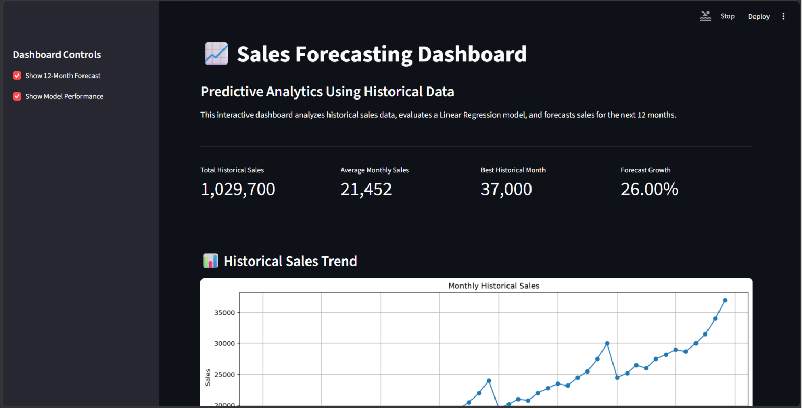
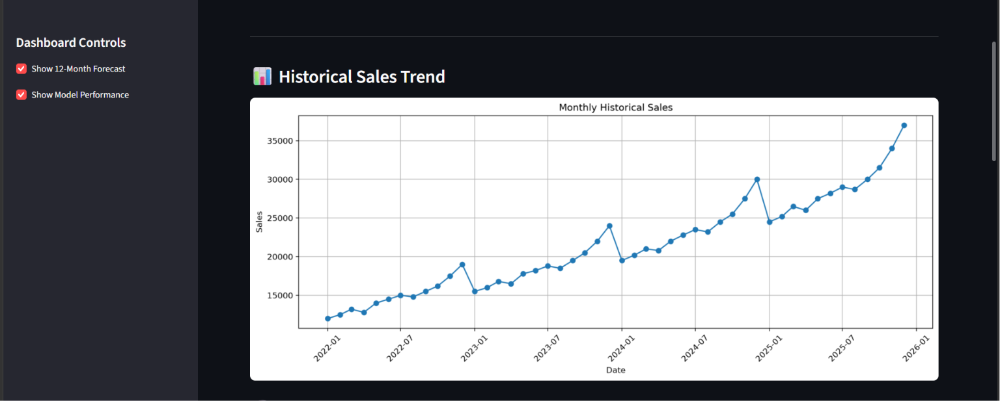
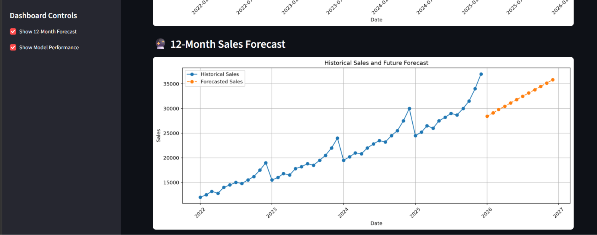
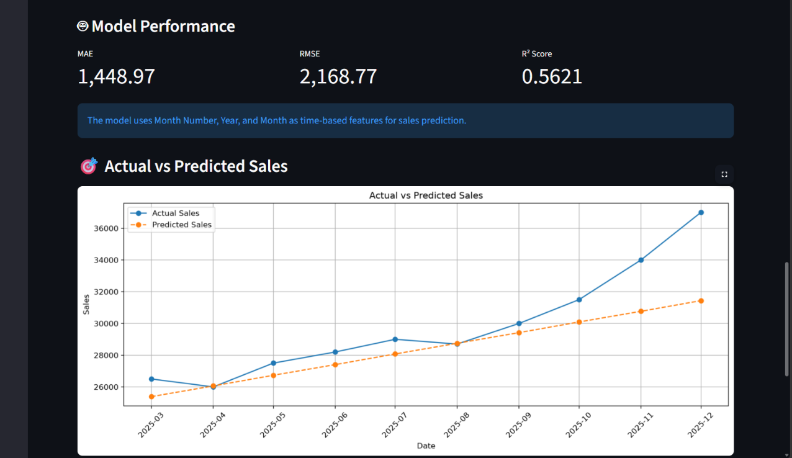
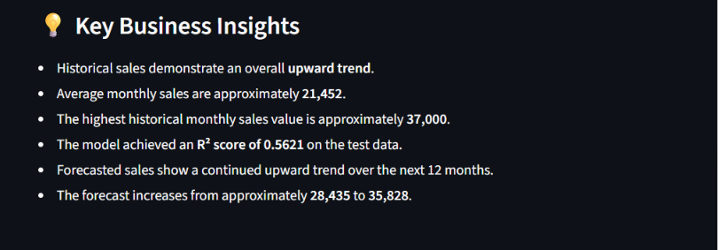

# 📊 Predictive Analytics Using Historical Data

<p align="center">
  <b>Sales Forecasting & Trend Analysis using Machine Learning</b>
</p>

<p align="center">
  A complete end-to-end predictive analytics project that uses historical monthly sales data, feature engineering, linear regression, model evaluation, and an interactive Streamlit dashboard to forecast future sales trends.
</p>

<p align="center">
  <a href="https://predictive-analytics-using-historical-data-4pza8rr8mxah5w6h3tp.streamlit.app/">
    
  </a>
  <a href="https://github.com/atharva123-buddy/Predictive-Analytics-Using-Historical-Data">
    
  </a>
</p>

---

## 📌 Project Overview

**Predictive Analytics Using Historical Data** is a machine learning project focused on **sales forecasting**.

The project analyzes historical monthly sales data from **January 2022 to December 2025** and uses the patterns in the historical dataset to estimate sales for the **next 12 months, January 2026 to December 2026**.

The complete workflow covers:

- Data loading and validation
- Data cleaning and preprocessing
- Exploratory Data Analysis (EDA)
- Sales trend analysis
- Feature engineering
- Regression model development
- Chronological train-test splitting
- Model evaluation
- Future sales forecasting
- Prediction visualization
- Business-oriented insights
- Interactive Streamlit dashboard

The project demonstrates how historical business data can be transformed into actionable forecasts that can support planning and decision-making.

---

## 🎯 Objectives

The main objectives of this project are to:

1. Analyze historical sales performance.
2. Identify overall sales trends over time.
3. Prepare historical data for predictive modeling.
4. Create meaningful time-based features.
5. Build a regression model for sales prediction.
6. Evaluate the model using standard regression metrics.
7. Forecast sales for the next 12 months.
8. Visualize actual, predicted, and forecasted sales.
9. Present the analysis through an interactive dashboard.
10. Demonstrate an end-to-end predictive analytics workflow.

---

## 🧠 Business Problem

Businesses often have historical sales records but need to estimate what future sales may look like.

Accurate forecasting can help with:

- Inventory planning
- Revenue planning
- Resource allocation
- Sales target setting
- Business strategy
- Demand planning
- Identifying growth trends

This project addresses the problem by using historical monthly sales data to build a machine learning model that provides a data-driven estimate of future sales.

---

## 📂 Dataset

The dataset is stored in:

```text
data/historical_sales.csv
```

### Dataset Details

| Attribute | Description |
|---|---|
| Time Period | January 2022 – December 2025 |
| Frequency | Monthly |
| Number of Records | 48 |
| Target Variable | Sales |
| Forecast Horizon | January 2026 – December 2026 |

### Columns

| Column | Description |
|---|---|
| `Date` | Monthly date |
| `Sales` | Historical monthly sales value |

The dataset is intentionally structured as historical monthly sales data so that time-based trends can be analyzed and used for forecasting.

---

## 🔄 Project Workflow

```text
Historical Sales Data
        ↓
Data Loading
        ↓
Data Inspection & Validation
        ↓
Data Preprocessing
        ↓
Exploratory Data Analysis
        ↓
Feature Engineering
        ↓
Train-Test Split
        ↓
Linear Regression Model
        ↓
Model Evaluation
        ↓
Future Sales Forecast
        ↓
Visualization
        ↓
Streamlit Dashboard
```

---

# 🔍 1. Data Loading & Inspection

The project begins by loading the CSV dataset using Pandas.

The `Date` column is converted into a proper datetime format and the records are sorted chronologically.

The analysis also checks:

- Dataset dimensions
- Data types
- Missing values
- Duplicate records
- Basic statistical information
- Minimum and maximum sales values

This ensures the dataset is ready for further analysis.

---

# 🧹 2. Data Preprocessing

The historical data is prepared before modeling.

The main preprocessing steps include:

- Converting `Date` into datetime format
- Sorting observations chronologically
- Resetting the dataframe index
- Checking for missing values
- Creating a sequential month number

A `Month_Number` feature is created to represent the progression of time:

```text
1, 2, 3, ..., 48
```

This allows the regression model to learn the relationship between time and sales.

---

# 📊 3. Exploratory Data Analysis

EDA is used to understand how sales have changed over the historical period.

The notebook includes visualizations for:

### Historical Sales Trend

A line chart shows the movement of monthly sales from 2022 through 2025.

### Yearly Sales Analysis

Annual sales performance is examined to understand how sales change from one year to another.

### Descriptive Statistics

Key statistics such as:

- Mean
- Standard deviation
- Minimum
- Maximum
- Quartiles

are used to understand the distribution of sales.

---

# 🛠️ 4. Feature Engineering

To improve the predictive model, additional time-based features are created.

The final model uses:

- `Month_Number`
- `Year`
- `Month`

These features allow the model to capture both the overall time trend and calendar-related differences.

### Feature Set

```text
Month_Number
Year
Month
```

### Target

```text
Sales
```

---

# 🤖 5. Machine Learning Model

The project uses **Linear Regression** from Scikit-learn.

Linear Regression was selected because the objective is to establish a clear relationship between time-based features and sales while keeping the model simple, interpretable, and easy to explain.

The model learns from the historical training data and then predicts sales for unseen observations.

---

# ✂️ 6. Train-Test Split

Because this is a time-based forecasting problem, the data is split **chronologically** rather than randomly.

The earlier observations are used for training and the later observations are reserved for testing.

This approach better represents a real-world forecasting scenario where future observations should not be used to train the model.

The dataset is divided into approximately:

- **80% Training Data**
- **20% Testing Data**

---

# 📏 7. Model Evaluation

The model is evaluated using three standard regression metrics.

### Mean Absolute Error (MAE)

Measures the average absolute difference between actual and predicted sales.

**Lower MAE = better performance.**

### Root Mean Squared Error (RMSE)

Measures prediction error while giving greater weight to larger errors.

**Lower RMSE = better performance.**

### R² Score

Measures how much of the variation in the target variable is explained by the model.

**Higher R² = better performance.**

---

## 📈 Model Performance

Two approaches were evaluated.

### Baseline Model

The baseline model used only:

```text
Month_Number
```

Performance:

| Metric | Score |
|---|---:|
| MAE | 1,671.35 |
| RMSE | 2,688.26 |
| R² | 0.3273 |

### Improved Model

The improved model used:

```text
Month_Number
Year
Month
```

Performance:

| Metric | Score |
|---|---:|
| MAE | 1,448.97 |
| RMSE | 2,168.77 |
| R² | 0.5621 |

### 📌 Interpretation

The improved model performs better than the baseline:

- MAE decreased from **1,671.35 → 1,448.97**
- RMSE decreased from **2,688.26 → 2,168.77**
- R² increased from **0.3273 → 0.5621**

Therefore, the improved feature set was selected as the final model.

> **Note:** These metrics are evaluation results on the project's chronological test set. They should not be interpreted as a guarantee of future forecasting accuracy.

---

# 🔮 8. Future Sales Forecast

The final model is used to forecast the next 12 months.

### Forecast Period

**January 2026 – December 2026**

| Month | Forecasted Sales |
|---|---:|
| Jan 2026 | 28,435 |
| Feb 2026 | 29,107 |
| Mar 2026 | 29,779 |
| Apr 2026 | 30,451 |
| May 2026 | 31,124 |
| Jun 2026 | 31,796 |
| Jul 2026 | 32,468 |
| Aug 2026 | 33,140 |
| Sep 2026 | 33,812 |
| Oct 2026 | 34,484 |
| Nov 2026 | 35,156 |
| Dec 2026 | 35,828 |

The forecast indicates a continued upward sales trend.

Based on the project forecast, sales increase by approximately **26%** from the beginning to the end of the forecast period.

---

# 📈 9. Interactive Streamlit Dashboard

The project includes an interactive dashboard built with **Streamlit**.

### Dashboard Features

The dashboard provides:

- 📊 Total historical sales
- 📈 Average monthly sales
- 🏆 Best historical month
- 🔮 Forecast growth
- 📉 Historical sales trend
- 🔮 12-month sales forecast
- 📏 Model performance metrics
- 🎯 Actual vs predicted sales
- 💡 Business insights

### Dashboard Preview

#### Sales Forecasting Dashboard



#### Historical Sales Trend



#### 12-Month Sales Forecast



#### Model Performance



#### Business Insights



---

## 🚀 Live Demo

Experience the interactive dashboard here:

**[🚀 Open Sales Forecasting Dashboard](https://predictive-analytics-using-historical-data-4pza8rr8mxah5w6h3tp.streamlit.app/)**

---

# 💡 Key Business Insights

The analysis provides several useful observations:

### 1. Positive Long-Term Trend

Historical sales show an overall upward movement across the analyzed period.

### 2. Forecasted Growth

The model predicts continued growth throughout the 2026 forecast period.

### 3. Increasing Sales Potential

The forecast progresses from approximately **28.4K in January 2026** to approximately **35.8K in December 2026**.

### 4. Time-Based Features Improve Performance

Adding `Year` and `Month` to the baseline `Month_Number` feature improved the evaluation metrics.

### 5. Forecasting Can Support Planning

The predictions can serve as a starting point for sales planning, inventory decisions, resource allocation, and business strategy.

---

# 🗂️ Project Structure

```text
Predictive-Analytics-Using-Historical-Data/
│
├── 📁 data/
│   └── historical_sales.csv
│
├── 📁 notebooks/
│   └── predictive_analysis.ipynb
│
├── 📁 screenshots/
│   ├── 12_month_sales.png
│   ├── business_insights.png
│   ├── historical_sales_trend.png
│   ├── model_performance.png
│   └── sales_forecasting.png
│
├── 📄 app.py
├── 📄 requirements.txt
├── 📄 README.md
└── 📄 .gitignore
```

---

# 💻 Technologies Used

| Technology | Purpose |
|---|---|
| 🐍 Python | Core programming language |
| 🐼 Pandas | Data manipulation and analysis |
| 🔢 NumPy | Numerical operations |
| 📊 Matplotlib | Data visualization |
| 📈 Seaborn | Statistical visualization |
| 🤖 Scikit-learn | Machine learning |
| 🌐 Streamlit | Interactive dashboard |
| 📓 Jupyter Notebook | Analysis and experimentation |
| 🔧 Git & GitHub | Version control and project hosting |

---

# ⚙️ How to Run Locally

## 1. Clone the Repository

```bash
git clone https://github.com/atharva123-buddy/Predictive-Analytics-Using-Historical-Data.git
cd Predictive-Analytics-Using-Historical-Data
```

## 2. Create a Virtual Environment

### Windows

```powershell
python -m venv venv
```

Activate it:

```powershell
venv\Scripts\activate
```

## 3. Install Dependencies

```powershell
pip install -r requirements.txt
```

## 4. Run the Streamlit Dashboard

```powershell
streamlit run app.py
```

The dashboard will open in your browser.

---

# 📓 Run the Jupyter Notebook

Start Jupyter Notebook with:

```powershell
jupyter notebook
```

Then open:

```text
notebooks/predictive_analysis.ipynb
```

Run the cells from top to bottom to reproduce the analysis, model evaluation, and forecast.

---

# 🔬 Methodology Summary

| Stage | Approach |
|---|---|
| Data Source | Historical monthly sales CSV |
| Period | 2022–2025 |
| Preprocessing | Datetime conversion, sorting, validation |
| Feature Engineering | Month Number, Year, Month |
| Model | Linear Regression |
| Split | Chronological 80/20 |
| Evaluation | MAE, RMSE, R² |
| Forecast | Next 12 months |
| Visualization | Matplotlib, Seaborn, Streamlit |
| Deployment | Streamlit Community Cloud |

---

# 🚧 Future Improvements

The current project provides a strong baseline forecasting workflow, but it can be extended further.

Potential improvements include:

- Implementing dedicated time-series models such as ARIMA or SARIMA
- Testing Random Forest and other machine learning regressors
- Adding lag-based sales features
- Adding rolling averages
- Modeling seasonality explicitly
- Using larger real-world sales datasets
- Adding product and regional dimensions
- Adding confidence intervals to forecasts
- Comparing multiple forecasting models automatically
- Adding interactive filters for year, month, product, and region

These improvements could help capture more complex patterns than the current linear model.

---

# 🎓 Internship Task

This project was developed as part of the **Predictive Analytics Using Historical Data** internship task.

The project demonstrates:

- Predictive modeling
- Historical trend analysis
- Data preprocessing
- Feature engineering
- Model evaluation
- Data visualization
- Business-oriented forecasting
- Interactive dashboard development

---

# 👨‍💻 Author

**Atharva Joshi**

Data Analytics & Machine Learning Project

---

## ⭐ Project Links

- 🚀 **Live Dashboard:** https://predictive-analytics-using-historical-data-4pza8rr8mxah5w6h3tp.streamlit.app/
- 💻 **GitHub Repository:** https://github.com/atharva123-buddy/Predictive-Analytics-Using-Historical-Data

---

## 📄 License

This project is created for educational and internship purposes.
